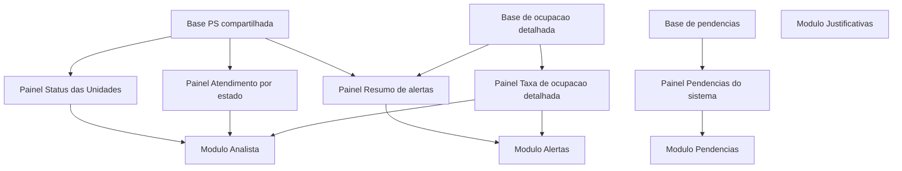

# Linhagem do Command Center

Este arquivo consolida a linhagem atual do aplicativo no formato `tabela -> painel -> modulo`.

## Mapa de tabelas

### Base PS compartilhada

- `cmc_hospital.ps_resumo_unidades_snapshot`
- `cmc_hospital.vw_painel_ps_base`
- `cmc_hospital.tbl_tempos_entrada_consulta_saida`
- `cmc_hospital.tbl_tempos_rx_e_ecg_total`
- `cmc_hospital.meta_tempos`
- `central_command.tbl_unidades_prod`
- `central_command.alerta_analisado`
- `central_command.alerta_analisado_log`
- `public.alerta_analisado_log`

### Base de ocupacao detalhada

- `cmc_hospital.vw_taxa_ocupacao_com_pacientes`
- `cmc_hospital.taxa_ocupacao_detalhada_snapshot_prod`
- `cmc_hospital.tbl_ocupacao_internacao`
- `central_command.tbl_unidades_prod`

### Base de pendencias

- `cmc_hospital.tbl_pendencias_sistema`

## Tabela de relacionamento

| Grupo de tabelas | Painel | Modulo | Observacao |
|---|---|---|---|
| Base PS compartilhada | Painel Status das Unidades | Modulo Analista | Base principal do resumo PS, compartilhada com o mapa 3D e outros cards executivos. |
| Base PS compartilhada | Painel Atendimento por estado | Modulo Analista | Usa a mesma base do resumo PS para alimentar o mapa 3D atual. |
| Base de pendencias | Painel Pendencias do sistema | Modulo Pendencias | Fluxo isolado e direto, sem dependencia do resumo PS. |
| Base PS compartilhada + Base de ocupacao detalhada | Painel Resumo de alertas | Modulo Alertas | Consolida sinais de PS e ocupacao para priorizacao operacional. |
| Base de ocupacao detalhada | Painel Taxa de ocupacao detalhada | Modulo Alertas / Modulo Analista | Painel analitico com foco em ocupacao e permanencia clinica detalhada. |
| Sem painel direto neste recorte | Modulo Justificativas | - | Camada estrutural mantida no diagrama para referencia de arquitetura. |

## Fluxograma Mermaid

## Leitura rapida

- `Status das Unidades` e `Atendimento por estado` compartilham a mesma base `ps/resumo-unidades`.
- `Pendencias do sistema` fica isolado em sua propria tabela.
- `Resumo de alertas` e `Taxa de ocupacao detalhada` compartilham a camada de ocupacao e a camada PS.
- `Modulo Justificativas` permanece como camada estrutural, sem painel direto neste recorte.
